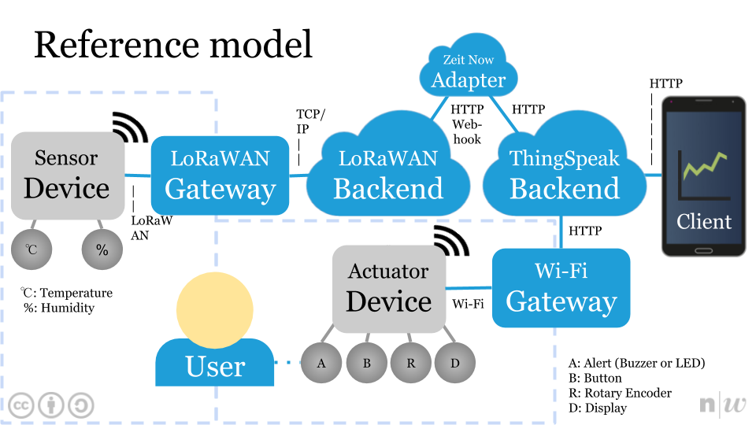

# IoT Engineering
## Project Example

## Introduction
This project is part of the [IoT Engineering](../../../fhnw-iot) course.

> * 2-person teams, building an IoT system.
> * 32 hours of work per person, 1 prototype.
> * 10' presentation of the project at Demo Day.
> * Slides, source code and setup steps on GitHub.
> * Both team members are able to explain the project.

It is a temperature and humidity monitoring system with a configurable alert, see [reference model](#reference-model) and [use case](#use-case) below.

### Team members
* [@tamberg](https://github.com/tamberg)
* [@DIYKulturZH](https://github.com/DIYKulturZH)

## Deliverables
> The following deliverables are mandatory.

### Source code
> Source code, Arduino C, JS or Python, committed to (this) project repo.

#### Sensor device
> Embedded code / microcontroller firmware.

##### Source code
* [Arduino/nRF52840_DHT11_Test/nRF52840_DHT11_Test.ino](Arduino/nRF52840_DHT11_Test/nRF52840_DHT11_Test.ino)
* [Arduino/nRF52840_LoRaWAN_Test/nRF52840_LoRaWAN_Test.ino](Arduino/nRF52840_LoRaWAN_Test/nRF52840_LoRaWAN_Test.ino)
* [Arduino/nRF52840_LoRaWAN_DHT11_Device/nRF52840_LoRaWAN_DHT11_Device.ino](Arduino/nRF52840_LoRaWAN_DHT11_Device/nRF52840_LoRaWAN_DHT11_Device.ino)

##### Setup software
* Edit [nRF52840_LoRaWAN_DHT11_Device.ino](Arduino/nRF52840_LoRaWAN_DHT11_Device/nRF52840_LoRaWAN_DHT11_Device.ino) to set TTN NwkSKey, AppSKey and DevAddr:

    ```
    static const u1_t PROGMEM NWKSKEY[16] = { 0x00, 0x00, 0x00, 0x00, 0x00, 0x00, 0x00, 0x00, 0x00, 0x00, 0x00, 0x00, 0x00, 0x00, 0x00, 0x00 };
    static const u1_t PROGMEM APPSKEY[16] = { 0x00, 0x00, 0x00, 0x00, 0x00, 0x00, 0x00, 0x00, 0x00, 0x00, 0x00, 0x00, 0x00, 0x00, 0x00, 0x00 };
    static const u4_t DEVADDR = 0x00000000;
    ```

##### Setup hardware
* The sensor device consists of a [nRF52840](https://github.com/tamberg/fhnw-iot/wiki/Feather-nRF52840-Express), [RFM95W](https://github.com/tamberg/fhnw-iot/wiki/FeatherWing-RFM95W), [Grove adapter](https://github.com/tamberg/fhnw-iot/wiki/Grove-Adapters#grove-shield-for-feather) and a [DHT11 sensor](https://github.com/tamberg/fhnw-iot/wiki/Grove-Sensors#temperature--humidity-sensor-dht11).
* Stack the nRF52840 on top of the RFM95W on top of the Grove adapter.
* Connect the DHT11 sensor to A4 of the Grove adapter.

#### Actuator device
> Embedded code / microcontroller firmware.

##### Source code
* [Arduino/ESP8266_Display_Test/ESP8266_Display_Test.ino](Arduino/ESP8266_Display_Test/ESP8266_Display_Test.ino)
* [Arduino/ESP8266_JSON_Test/ESP8266_JSON_Test.ino](Arduino/ESP8266_JSON_Test/ESP8266_JSON_Test.ino)
* [Arduino/ESP8266_MqttSubClient_Test/ESP8266_MqttSubClient_Test.ino](Arduino/ESP8266_MqttSubClient_Test/ESP8266_MqttSubClient_Test.ino)
* [Arduino/ESP8266_SetAlert_Test/ESP8266_SetAlert_Test.ino](Arduino/ESP8266_SetAlert_Test/ESP8266_SetAlert_Test.ino)
* ...

##### Setup software
* Set Wi-Fi credentials

    ```
    const char *ssid = "MY_SSID";
    const char *password = "MY_PASSWORD";
    ```

* Set ThingSpeak keys

    ```
    const char *mqttPassword = "TS_MQTT_API_KEY";
    const char *channelId = "TS_CHANNEL_ID";
    const char *readApiKey = "TS_READ_API_KEY";
    ```

##### Setup hardware
* The actuator device consists of a [ESP8266](https://github.com/tamberg/fhnw-iot/wiki/Feather-Huzzah-ESP8266), [Grove adapter](https://github.com/tamberg/fhnw-iot/wiki/Grove-Adapters#grove-shield-for-feather), [buzzer](https://github.com/tamberg/fhnw-iot/wiki/Grove-Actuators#buzzer), [button](https://github.com/tamberg/fhnw-iot/wiki/Grove-Sensors#button), [rotary angle sensor](https://github.com/tamberg/fhnw-iot/wiki/Grove-Sensors#rotary-angle-sensor), and a [display](https://github.com/tamberg/fhnw-iot/wiki/Grove-Actuators#4-digit-display-tm1637).
* Stack the ESP8266 on top of the Grove adapter.
* Connect the buzzer to D2, button to D4, rotary angle sensor to A0, display to I2C_1 of the Grove adapter.

#### TTN backend
> ... IoT platform setup steps.

* Register an application named _fhnw-project-example_
* Register a device named _fhnw-project-example-arduino-1_
* Get ABP keys, _NwkSKey_, _AppSKey_ and _DevAddr_ (for [nRF52840 setup](https://github.com/tamberg/fhnw-iot-project-example/blob/master/README.md#setup-software) above)
* See http://www.tamberg.org/fhnw/2019/IoT08LoRaWANConnectivity.pdf p.18, 19 and 21

#### ThingSpeak dashboard
> ... IoT platform setup steps.

* Go to http://thingspeak.com
* Create a Channel per TTN device
* Add _field1_ named _Temperature_
* Add _field2_ named _Humidity_
* Set channel visibility to public (for demo)

#### TTN to ThingSpeak adapter
> Glue Code used on the gateway or "in the cloud".

##### Source code
* [Nodejs/TtnToThingSpeakAdapter/index.js](Nodejs/TtnToThingSpeakAdapter/index.js)
* [Nodejs/TtnToThingSpeakAdapter/now.json](Nodejs/TtnToThingSpeakAdapter/now.json)

##### Setup
* Edit [index.js](Nodejs/TtnToThingSpeakAdapter/index.js) to add your TTN AppID:

    ```
    const appId = "TTN_APP_ID";
    ```
    
    and per device TTN device IDs and ThingSpeak Write API keys:

    ```
    const writeApiKeys = {
        "TTN_DEVICE_ID_1": "WRITE_API_KEY_1", // CHANNEL_ID_1
        ...
    }
    ```

* To deploy the code on [Zeit Now](https://zeit.co/now), type:<pre>
$ cd Nodejs/TtnToThingSpeakAdapter
$ now</pre>

### Presentation
> 4-slide presentation, PDF format, committed to (this) project repo.

* [Docs/ProjectExample.pdf](Docs/ProjectExample.pdf)

#### Use case
> Use-case of your project.

This project is a temperature and humidity monitoring system with a configurable alert.

* Measure temperature and humidity ✓
* Display (historic) measurements ✓
* Set a temperature or humidity alert threshold
* Get a temperature or humidity alert
* Confirm an alert

Why? "Cellar is too humid", "Oven is ready", ...

#### Reference model
> Reference model of your project.



#### Interface documentation
> Single slide interface documentation.

* HTTP API to write to ThingSpeak

    ```
    $ curl -vX POST https://api.thingspeak.com/update --data 'key=WRITE_API_KEY&field1=23&field2=42'
    ```

* MQTT API to read from ThingSpeak

    ```
    $ mqtt sub -t 'channels/CHANNEL_ID/subscribe/json/READ_API_KEY' -h 'mqtt.thingspeak.com' -u 'esp8266-CHANNEL_ID' -P 'MQTT_API_KEY' -p 1883 -q 0
    
    {
      "channel_id":0,
      "created_at":"2019-04-22T15:44:18Z",
      "entry_id":2706,
      "field1":"23",
      "field2":"42",
      "latitude":null,
      "longitude":null,
      "elevation":null,
      "status":null
    }
    ```

#### Issues
> Issues you faced, how you solved them.

* ESP8266 programming works without adapter only.
* [Pin collision](https://github.com/tamberg/fhnw-iot-project-example/issues/2), D5 used by both, DHT11 and RFM95W.
* [Connecting to ThingSpeak MQTT API](https://github.com/tamberg/fhnw-iot-project-example/issues/), -u, -P, QoS 0.
* Getting the state machine right on actuator device.
* For details, see [issues on GitHub](../../issues).

### Live demo
> Working end-to-end prototype, "device to cloud", part of your 10' presentation.

* https://thingspeak.com/channels/758483
* https://MY_TEAM_PROJECT_DEMO_HOST:PORT/

1) Sensor input on a IoT device triggers an event.
2) The event or measurement shows up online, in an app or Web client.
3) The event triggers actuator output on the same or on a separate IoT device.

## Submission deadline
> Commit and push to (this) project repo before Demo Day, _03.06.2019, 00:00_.
